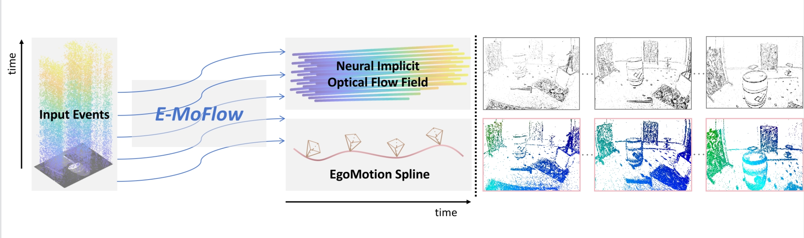

<h1 align="center"> 🥺 E-MoFlow: Learning Egomotion and Optical Flow from Event Data via Implicit Regularization  </h1>

<div align="center"><h3>[NeurIPS 2025]</h3></div>
<div align="center">
    <a href="https://akawincent.github.io/">Wenpu Li*</a>
    &nbsp;·&nbsp;
    <a href="https://bangyan101.github.io/">Bangyan Liao*</a>
    &nbsp;·&nbsp;
    <a href="https://sites.google.com/view/zhouyi-joey/home">Yi Zhou</a>
    &nbsp;·&nbsp;
    <a href="https://github.com/insomniaaac">Qi Xu</a>
    &nbsp;·&nbsp;
    <a href="https://i.rm2.net/">Pian Wan</a>
    &nbsp;·&nbsp;
    <a href="https://ethliup.github.io/">Peidong Liu†</a>

<!-- <h3 align="center"><a href="https://arxiv.org/abs/2505.21060">Paper</a> | <a href="https://akawincent.github.io/EMoFlow/">Project Page</a> </h3> -->
<a href="https://akawincent.github.io/EMoFlow/">Project Page</a> </h3>


</div>

> This repository is an official PyTorch implementation of the paper "E-MoFlow: Learning Egomotion and Optical Flow from Event Data via Implicit Regularization". We reavel that implicit regularizations can enable the mutual promotion of self-supervised learning for optical flow and egomotion.  Importantly, our method is capable of simultaneously learning the optical flow field and camera motion solely from event data.


## 📢 News & 🚧 TODO
- [ ] Add point tracking visualization results.
- [ ] Use uv to manage project environments and dependencies.
- [ ] Release the training code for DSEC dataset、
- [ ] Publish the v1 paper on arXiv.
- `2025.10.13` Training code for MVSEC dataset has been released. 
- `2025.10.12` Our project homepage is available online.
- `2025.09.18` Our paper was accepted by NeurIPS2025!! Congratulates to all collaborators!!

## ⚙️ Installation

## 📊 Data Preparation

## 🚀 Run

## 📖 Citation

If you find our work useful, please consider citing our paper:

```bibtex
@inproceedings{li2025emoflow,
      author = {Wenpu Li and Bangyan Liao and Yi Zhou and Qi Xu and Pian Wan and Peidong Liu},
      title = {E-MoFlow: Learning Egomotion and Optical Flow from Event Data via Implicit Regularization},
      booktitle = {Annual Conference on Neural Information Processing Systems (NeurIPS)},
      year = {2025}
  } 